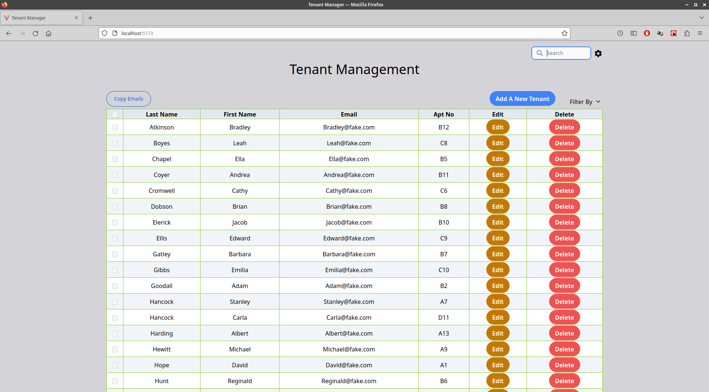
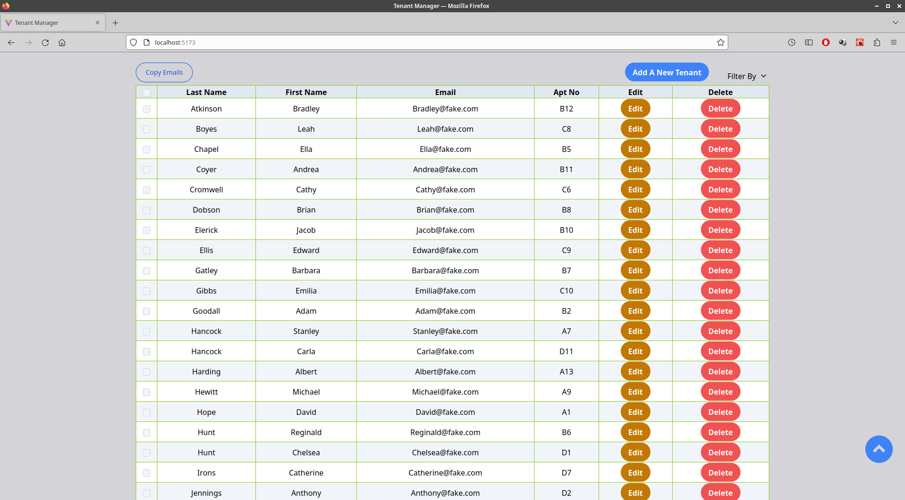
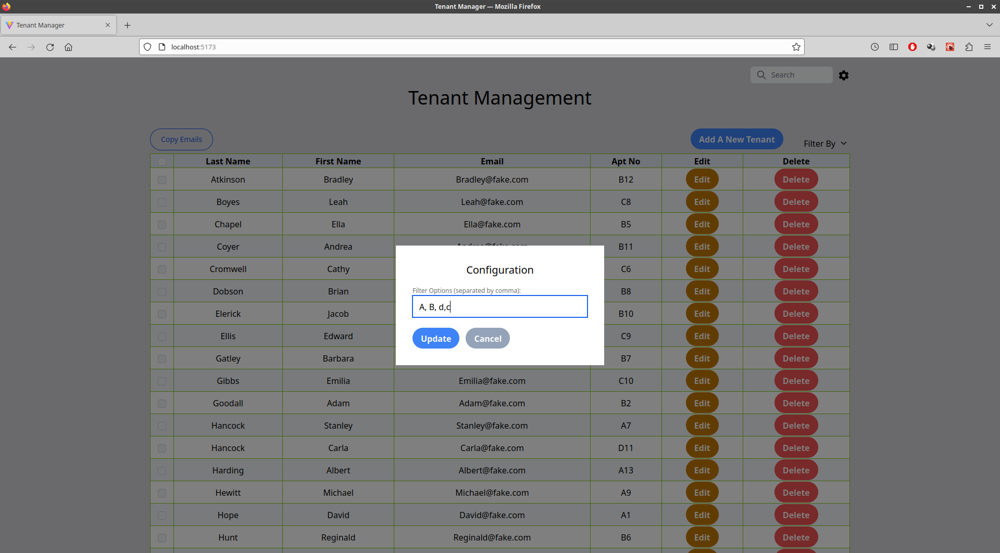
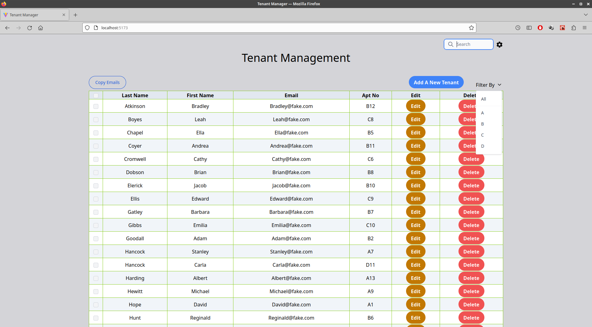
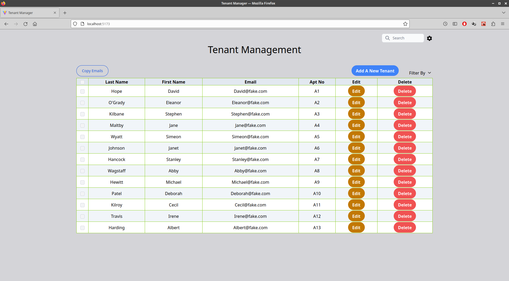
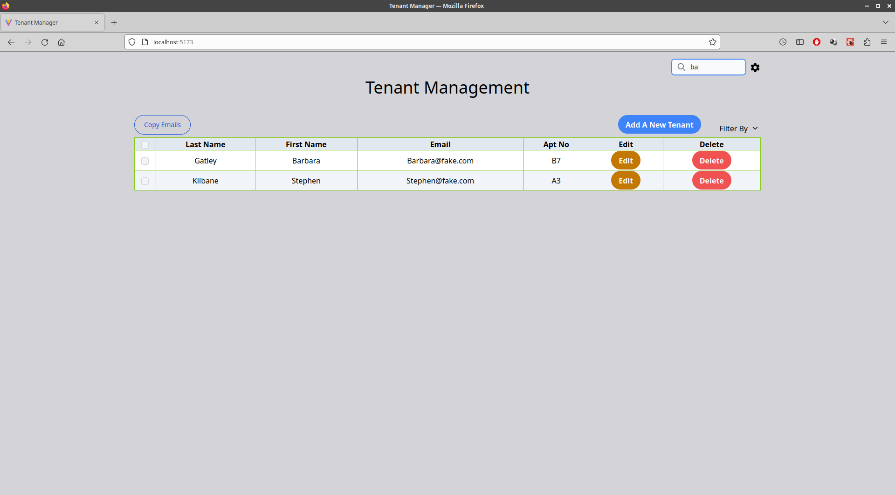
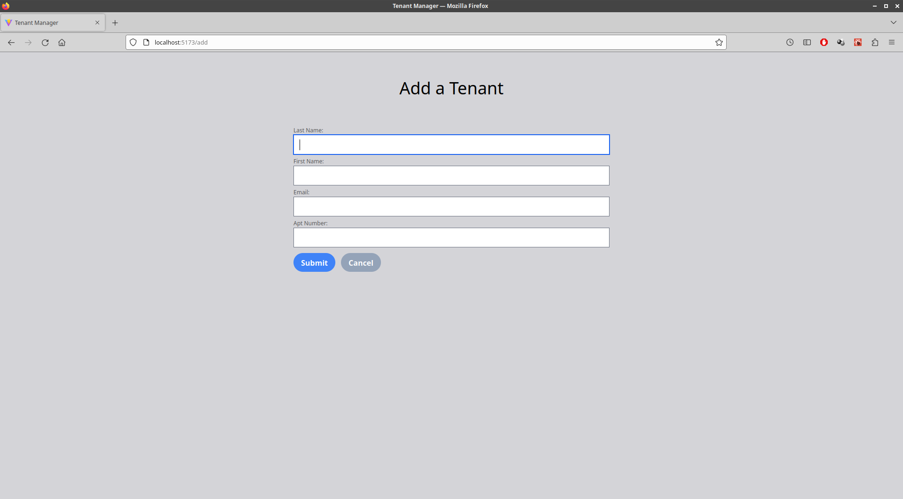
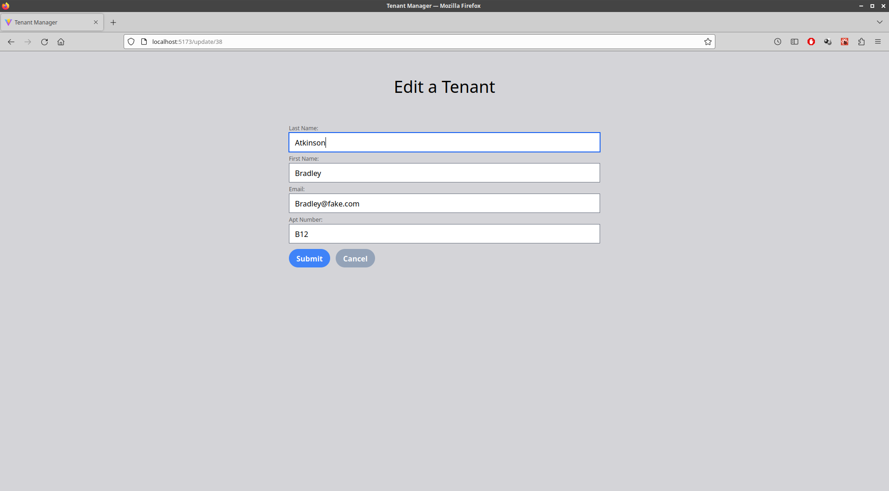
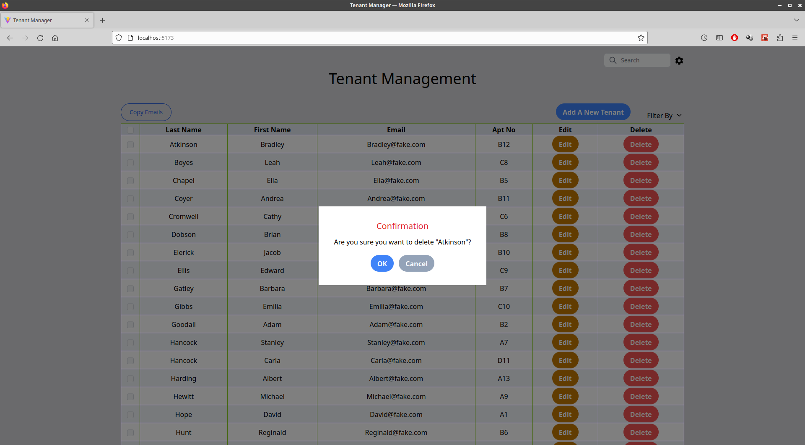
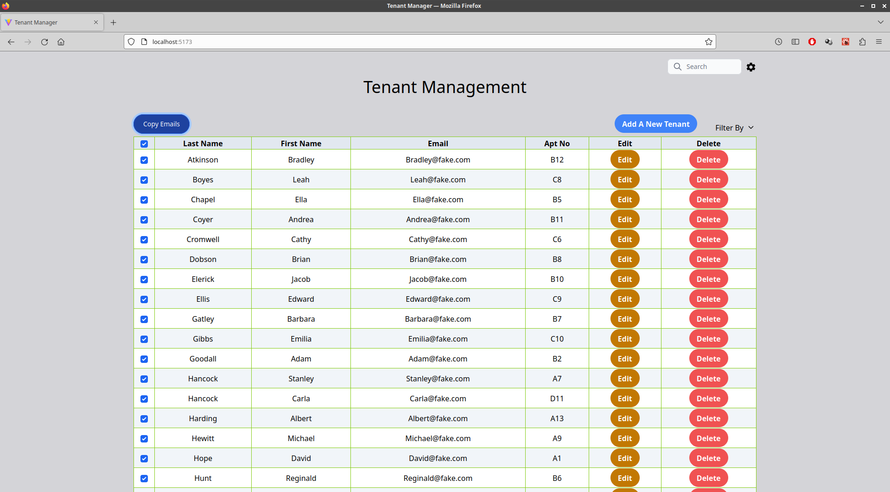

# Tenant Management Application with React & PHP CRUD

## Table of Contents
---
- [Overview](#overview)
- [Built with](#built-with)
- [Features](#features)
- [Things To Be Improved](#things-to-be-improved)

## Overview
---

This is a tenant management application using React and PHP. An apartment manager can list all tenants or only tenants filtered by the apartment building numbers that can be configured in settings. The manager also can search tenants by their last or first name. Tenant information can be added, edited and deleted. Finally, email address of selected tenants can be copied to clipboard. They can be pasted into To, Cc or Bcc in any email services.

&nbsp;
### Built With

#### Frontend:
- [React JS](https://reactjs.org/)
- [Tailwind CSS](https://tailwindcss.com/)

#### Backend:
- [PHP](https://www.php.net/)

#### SQL Database:
- [PostgreSQL](https://www.postgresql.org/)

## Features
---
- A user can get a list of tenants by filtering by the configured options and search a tenant by the last or first name 
- A user can select all tenants at once or indvidual tenant to copy the email address

## Things To Be Improved
----
1. Instead of copying email addresses, automatically, launching an email service like Outlook with email addresses in recipient
2. Adding a function to let a user export/import a list of tenants to/from a file like Excel
